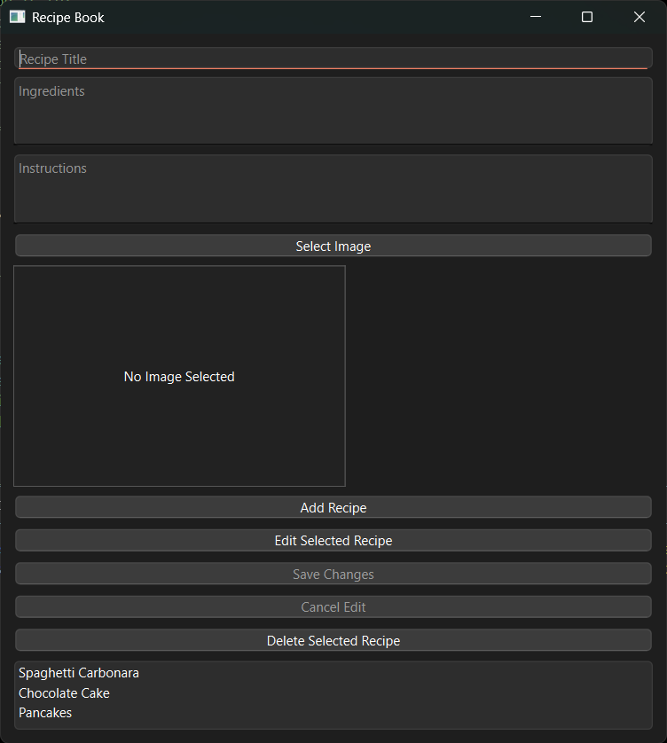
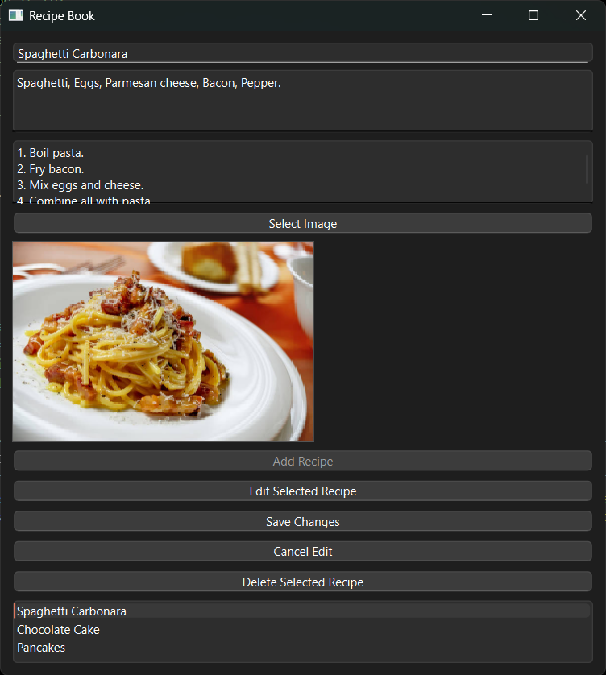

# 📖 Recipe Book (PySide6 + MVC)

A desktop recipe manager built with **PySide6** using the **Model–View–Controller (MVC)** architecture.  
This app allows users to add, edit, delete, and view recipes with optional images — a perfect example project for learning PySide6 and clean architecture in Python.

---

## ✨ Features

- **Add Recipes**: Store recipe title, ingredients, instructions, and an image.
- **Edit Recipes**: Update existing recipes without creating duplicates.
- **Delete Recipes**: Remove recipes from the database.
- **Image Support**: Select and display images while keeping aspect ratio.
- **SQLite Database**: Persistent storage with `sqlite3`.
- **MVC Architecture**: Clear separation between logic, data, and UI.

---

## 📂 Project Structure
```
 recipe_book_app/
│
├── controller/
│ └── recipe_controller.py # Handles user actions, talks to Model, updates View
│
├── model/
│ ├── database.py # Low-level SQLite data storage
│ └── recipe_model.py # Recipe object + CRUD operations
│
├── view/
│ └── main_window.py # PySide6 GUI (widgets, layout, user input/output)
│
├── images/ # Optional images for sample recipes + screenshots
│ ├── carbonara.jpg
│ ├── chocolate_cake.jpg
│ ├── main_window.png
│ └── edit_mode.png
|
├── .gitignore
├── recipes.db # SQLite database file
├── main.py # Entry point: wires Model, View, Controller together
└── README.md # Project documentation
```

---

## 🛠 Technologies Used

- **Python 3.9+**
- **PySide6** — GUI framework
- **SQLite** — lightweight database
- **MVC Pattern** — clean architecture

---

## 🚀 Getting Started

## 1️⃣ Clone the Repository
```bash
git clone https://github.com/ZhAngelova/recipe-book-pyside6.git
cd recipe-book-pyside6
```
## 2️⃣ Create a Virtual Environment
```bash
python -m venv .venv
```
Activate it:

Windows (PowerShell):

```powershell
.venv\Scripts\Activate.ps1
```
MacOS/Linux:

```bash
source .venv/bin/activate
```
## 3️⃣ Install Dependencies
```bash
pip install PySide6
```
## 4️⃣ Run the Application
```bash
python main.py
```
## 📚 How It Works (MVC Overview)
Model (`model/`)
Manages application data and business logic. Talks directly to the database.

View (`view/`)
Handles all GUI elements (buttons, forms, lists). Knows nothing about the database.

Controller (`controller/`)
The bridge between View and Model. Responds to user actions, updates Model, refreshes View.

Example flow:
User clicks "Add Recipe" → Controller reads form from View → Controller calls Model.add_recipe() → Model updates Database → Controller refreshes View

## 📸 Screenshots

**Main Window**



**Editing a Recipe**




## 🎯 Who This Project Is For

- 🆕 **Beginners** learning PySide6 and desktop GUI development.  
- 🛠 **Developers** practicing the Model–View–Controller (MVC) design pattern in Python.  
- 📦 Anyone wanting to build a **desktop CRUD app** with images and persistent storage.  
- 📚 Students looking for a clean, well-commented example for **portfolio projects**.


## 📝 License
MIT License — free to use and modify.

## 👨‍💻 Author
**Zhasmina Angelova**  
📧 zhasminangelova@gmail.com  
💼 [https://www.linkedin.com/in/zhasmina-angelova](https://www.linkedin.com/in/zhasmina-angelova)  
🐙 [https://github.com/ZhAngelova](https://github.com/ZhAngelova)


